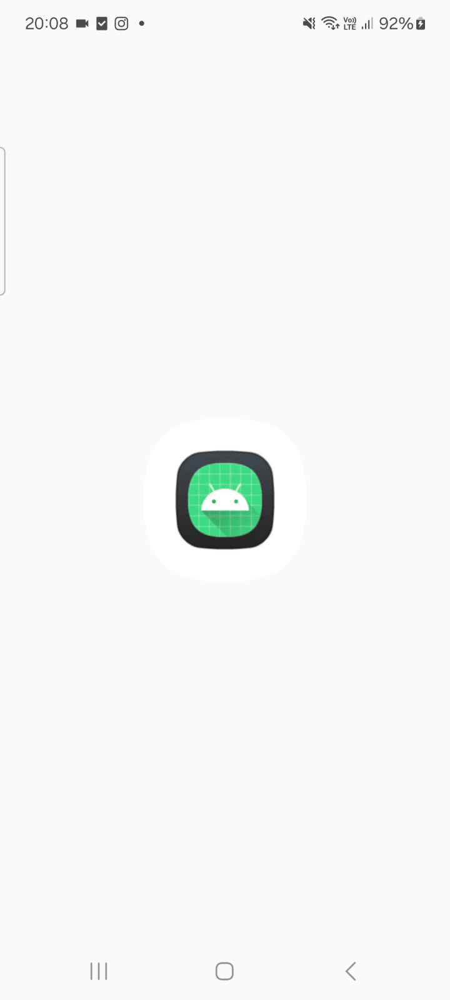

# Android Real-Time Edge Detection with OpenCV & OpenGL ES

This project is a minimal Android application that captures live camera frames, processes them in real time using OpenCV (C++ via JNI), and displays the processed output efficiently using OpenGL ES.

--------------------------------------------------------------------------------


## Features

**Camera Feed Integration**

* Utilizes Android’s Camera2 API with `TextureView` for capturing live camera feed.
* Sets up a repeating image capture stream for continuous frame acquisition.

**Real-Time Frame Processing via OpenCV (C++)**

* Frames are sent to native C++ code using JNI.
* Image processing pipeline includes (some were removed to get more fps):

  * Grayscale conversion
  * CLAHE
  * Gaussian Blur
  * Canny Edge Detection with fixed, optimized thresholds
  * Morphological Closing to refine edges

**OpenGL ES-Based Rendering**

* Uses OpenGL ES 2.0 to render processed frames onto a `GLSurfaceView`.
* GPU rendering ensures smooth playback, targeting 10–15 FPS.

**FPS Display**

* Displays live frames-per-second (FPS) count on screen for real-time performance monitoring.


--------------------------------------------------------------------------------


## GIF of the working app




--------------------------------------------------------------------------------

## Setup Instructions

**1. Clone the Repository**

```
git clone https://github.com/AidenTempest/FrameProcessor
cd FrameProcessor
```

**2. Open in Android Studio**

* Launch Android Studio.
* Select “Open an existing Android Studio project” and open the `FrameProcessor` directory.

**3. Configure NDK and CMake**

* Ensure NDK and CMake are installed via SDK Manager.
* Android Studio will auto-detect the NDK and CMake configuration via `CMakeLists.txt`.

**4. Add OpenCV SDK**

* Download the OpenCV Android SDK from [https://opencv.org/releases/](https://opencv.org/releases/)
* Place the `opencv-android-sdk` folder in the parent directory of the `FrameProcessor` project.
* The `CMakeLists.txt` is already configured to find the library at `../../../opencv-android-sdk/`.

**5. Build and Run**

* Connect an Android device with a camera or use an emulator with camera access enabled.
* Press “Run” in Android Studio.

--------------------------------------------------------------------------------

## Project Architecture and Frame Flow

**Java/Kotlin Layer (`/app`)**

* `MainActivity.java`:

  * Sets up the camera feed and periodic frame capture.
  * Converts captured frames to `Mat` and passes them to native code via JNI.
* `GLRenderer.java`:

  * Manages OpenGL ES 2.0 rendering.
  * Handles texture upload and rendering to screen.

**Native C++ Layer (`/app/src/main/jni`)**

* `edge_detector.cpp`:

  * Implements the OpenCV image processing pipeline.
  * Exposes a JNI function `processFrame()` which is called from Java.

**Frame Processing Flow**

1. Frame is captured from the `TextureView`.
2. Frame is converted to `Mat` in Java and passed to C++ through JNI.
3. C++ processes the frame using OpenCV.
4. Output is copied back to Java.
5. Java passes the result to the OpenGL renderer which displays it in real time.

-----------------------------------------------------------------------------------


## Performance

* Achieves approximately 10–15 FPS on mid-range Android devices.
* Designed to be responsive and lightweight while delivering quality edge-detection results.

-----------------------------------------------------------------------------------